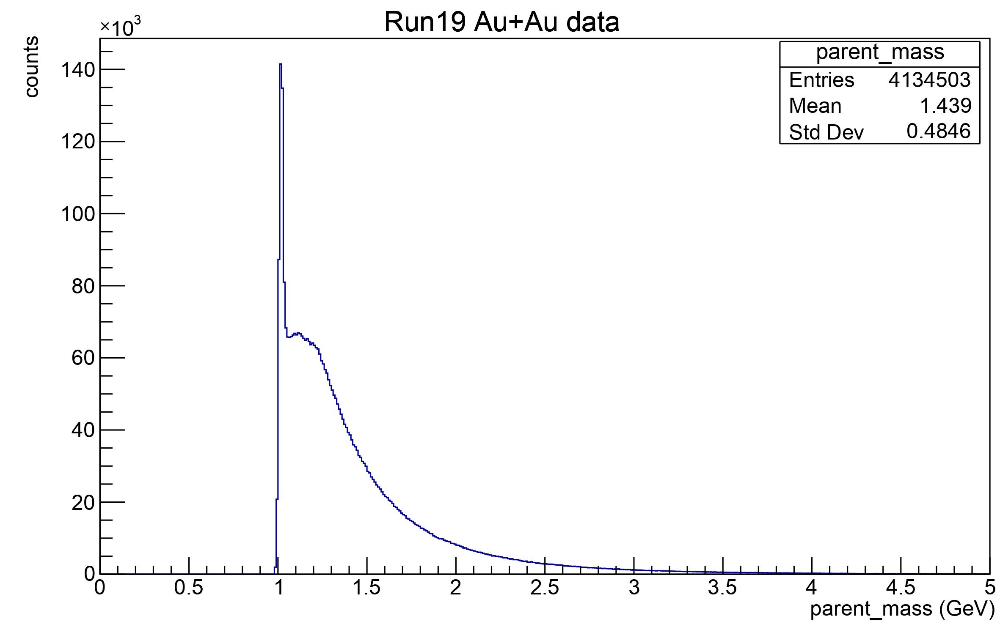
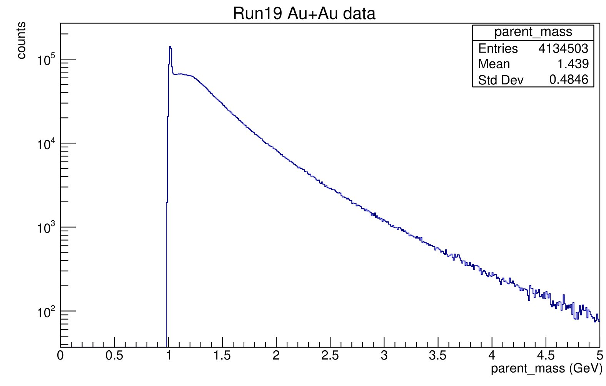

# Intro Tasks

## Loading a `.root` file 

`.root` files can be loaded in the command line by typing `root -l <filename>`

After the file is loaded, the shell will automatically give an interactive prompt in `root`. To view the file via `TBrowser`, simply run 
`TBrowser b`. This will launch a GUI interface that allows you to browse the data.

It seems like TBrowser is nothing but a class in C++, and `TBrowser b` simply create a instance of TBrowser named `b`. This seems like a common theme in ROOT.

For more information regarding `TBrowser`, visit [this reference](https://root.cern/doc/v626/classTBrowser.html)

And I used [this website](https://www.nevis.columbia.edu/~seligman/root-class/html/Introduction.html) as a quick starter. To starting learning working with ROOT.

## Looking at `FemtoPairFormat.h`

It seems like `FentiOaurFormat.h` is a header file that defines the class `FemtoPair`, which is a derived class of `FemtoDstBranch`. My editor is giving me errors about `file not found` for the header file `TObject.h`. I think this is because we don't actually have all the header file of ROOT in our current working directory, and I suppose when I use `root` to build this class, `root` automatically does the linking.

The structure of class `FemtoPair` includes all the variables that we can browse using the Root object browser for our input `.root` file. It also has a reset method which reset the value of these attributes, and a copy method that copy the attributes from another pointer of `FemtoPair` instance.

## Looking at `ana.C`

I recognized that the actual plotting script is the file `ana.C`, so I decided to take a look at it. It seems like this is the file to modify if I want to graph other data.

The script included many header files from ROOT, and the header file `FemtoPairFormat.h`. I looked through the class reference to at least have an idea what those classes do.

The comments are very self-explanatory. Just wondering when is it acceptable to use `auto *`. 

## Making Plots

I took a look at making histograms. Because I know very roughly how pointer works and how to extract attributes from a pointer to `TLorentzVector`, I kind of know out of the box how to plot different things. In general, the steps are:

1. Create an pointer to the type of graph. In our case, `TH1F` with its parameters.
2. Open the input `.root` file 
3. Create the data reader
4. Load the data format
5. Iterate through the data, calculate anything if needed, fill the histogram using the `Fill` method.
6. Use the `Draw` method in our `TH1F` object 
7. Output the file 

## First Attempt in Deriving Parent Particle Mass

I am not so familiar with 4-vectors- especially the kind $\left( P_T, \eta, \phi, m \right)$. I pretty much followed the [Wikipedia Page](https://en.wikipedia.org/wiki/Pseudorapidity) for Pseudorapidity, where the conversion to $(p_x, p_y,p_z)$ is given. I then added them to the rest mass for Kaon to get $E$. 

I did this for both daughter particles, added their 4-momentum vector in Cartesian Coordinates, and extracted the rest mass by just doing $E-|p_i|$.

I will definitely need to review my special relativity knowledge and get familiar with natural units, but here is what I got using my (very memory and computational inefficient) results.

I think the resonance mass is just around 1GeV. 
